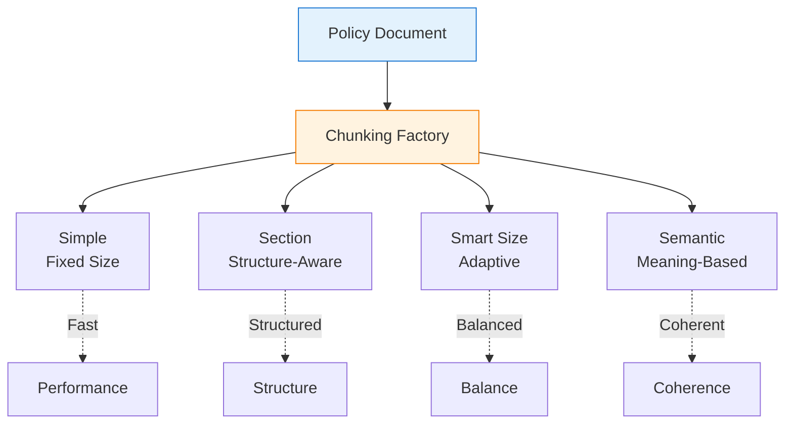

# Chunking Strategies Architecture

Chunking is the process of breaking down large insurance policy documents into smaller, semantically meaningful segments that can be efficiently searched and retrieved. GPT_AITIS implements 7 sophisticated chunking strategies, each optimized for different document structures and query patterns common in insurance analysis.

## Strategy Architecture


The Chunking Strategies diagram illustrates how the system intelligently breaks down insurance policy documents. Here's the flow:

**Document Processing Flow:**

- A Policy Document enters the Chunking Factory, which serves as the strategy selector
- The Factory chooses one of four strategies based on configuration:
   - **Simple**: Splits text into fixed-size chunks (e.g., every 200 words)
   - **Section**: Recognizes document structure (headers, articles, sections)
   - **Smart Size**: Adjusts chunk size based on content importance
   - **Semantic**: Groups sentences by meaning similarity
- All strategies feed into an Evaluation step that validates chunk quality
- Output is Optimal Chunks ready for embedding and storage

**Strategy Characteristics (dotted lines):**

- Simple → Fast: Quickest processing but least intelligent
- Section → Structured: Preserves document organization
- Smart Size → Balanced: Optimizes between size and importance
- Semantic → Coherent: Best semantic grouping but slowest

The Factory pattern allows easy switching between strategies without changing downstream components.

## Core Architecture

### **Base Chunking Interface**

All chunking strategies implement a common interface, ensuring consistency and allowing strategies to be swapped without changing the rest of the system. This design pattern enables A/B testing of different approaches and strategy selection based on document characteristics.

```python
class ChunkingStrategy(ABC):
    """Abstract base class for all chunking strategies"""
    
    @abstractmethod
    def chunk(self, text: str, document_id: str) -> List[TextChunk]:
        """Split text into chunks with metadata"""
        pass
    
    @abstractmethod
    def get_config(self) -> Dict[str, Any]:
        """Return current configuration"""
        pass
    
    def validate_chunks(self, chunks: List[TextChunk]) -> bool:
        """Ensure chunks meet quality standards"""
        for chunk in chunks:
            if len(chunk.text.split()) < 10:  # Too small
                return False
            if len(chunk.text.split()) > 1000:  # Too large
                return False
        return True
```

### **Chunking Factory**

The factory pattern centralizes strategy creation and configuration, making it easy to add new strategies or modify existing ones. It also handles strategy registration and provides a unified interface for the rest of the system.

```python
class ChunkingFactory:
    """Factory for creating chunking strategies"""
    
    _strategies: Dict[str, Type[ChunkingStrategy]] = {}
    _default_configs: Dict[str, Dict[str, Any]] = {}
    
    @classmethod
    def register_strategy(cls, 
                         name: str, 
                         strategy_class: Type[ChunkingStrategy],
                         default_config: Dict[str, Any] = None):
        """Register a new chunking strategy"""
        cls._strategies[name] = strategy_class
        if default_config:
            cls._default_configs[name] = default_config
    
    @classmethod
    def create_strategy(cls, 
                       name: str, 
                       config: Dict[str, Any] = None) -> ChunkingStrategy:
        """Create a chunking strategy instance"""
        if name not in cls._strategies:
            raise ValueError(f"Unknown strategy: {name}")
        
        # Merge with default config
        final_config = cls._default_configs.get(name, {}).copy()
        if config:
            final_config.update(config)
        
        return cls._strategies[name](**final_config)
```

## Chunking Strategies

### **Simple Chunking**

Simple chunking divides documents into fixed-size segments based on word or token count. While basic, it's fast and predictable, making it suitable for initial prototyping or when document structure is unknown.

```python
class SimpleChunking(ChunkingStrategy):
    """Fixed-size chunking with optional overlap"""
    
    def __init__(self, 
                 max_words: int = 200,
                 overlap_words: int = 20,
                 preserve_sentences: bool = True):
        self.max_words = max_words
        self.overlap_words = overlap_words
        self.preserve_sentences = preserve_sentences
    
    def chunk(self, text: str, document_id: str) -> List[TextChunk]:
        """Create fixed-size chunks"""
        # Implementation details...
```

**Configuration Example:**
```python
config = {
    "max_words": 200,        # Words per chunk
    "overlap_words": 20,     # Overlap for context
    "preserve_sentences": True  # Don't split sentences
}
```

### **Section-Based Chunking**

Section-based chunking recognizes document structure using headers, numbering, and formatting cues. This strategy preserves the logical organization of insurance policies, keeping related provisions together.

```python
class SectionChunking(ChunkingStrategy):
    """Chunks documents by their natural sections"""
    
    def __init__(self,
                 section_patterns: List[str] = None,
                 max_section_words: int = 500,
                 include_title: bool = True,
                 hierarchical: bool = True):
        self.section_patterns = section_patterns or self._default_patterns()
        self.max_section_words = max_section_words
        self.include_title = include_title
        self.hierarchical = hierarchical
```

**How It Works:**

1. **Pattern Detection**: Identifies section headers using regex patterns
2. **Hierarchy Recognition**: Maintains parent-child relationships (Article > Section > Subsection)
3. **Smart Splitting**: Breaks large sections while preserving context
4. **Title Inclusion**: Prepends section titles for context

**Pattern Examples:**
```python
patterns = [
    r"^Article \d+",          # Article 1, Article 2
    r"^Section \d+\.\d+",     # Section 1.1, Section 2.3
    r"^[A-Z][A-Z\s]+$",       # GENERAL PROVISIONS
    r"^\d+\.\s+[A-Z]",        # 1. Coverage
]
```

### **Smart Size Chunking**

Smart size chunking dynamically adjusts chunk sizes based on content importance. It creates larger chunks for critical sections (exclusions, limits) and smaller chunks for routine text, optimizing both retrieval precision and context preservation.

```python
class SmartSizeChunking(ChunkingStrategy):
    """Adaptive chunking based on content importance"""
    
    def calculate_importance(self, text: str) -> float:
        """Score text importance for insurance context"""
        score = 0.0
        
        # Key terms increase importance
        important_terms = [
            'exclusion', 'limit', 'deductible', 'coverage',
            'eligible', 'required', 'maximum', 'minimum'
        ]
        
        # Financial amounts are critical
        if re.search(r'\$[\d,]+', text):
            score += 0.3
            
        # Definitions are important
        if ':' in text or 'means' in text.lower():
            score += 0.2
            
        return min(score, 1.0)
```

**Adaptive Algorithm:**

1. **Importance Scoring**: Analyzes each sentence for key insurance elements
2. **Dynamic Sizing**: `target_size = base_size * (1 + importance * multiplier)`
3. **Boundary Detection**: Finds natural break points (paragraphs, sentences)
4. **Context Preservation**: Ensures important information isn't split

### **Semantic Chunking**

Semantic chunking uses sentence embeddings to group related content together. It measures semantic similarity between consecutive sentences and creates chunk boundaries where meaning shifts significantly.

```python
class SemanticChunking(ChunkingStrategy):
    """Groups semantically similar content"""
    
    def __init__(self,
                 embedding_model: str = "all-MiniLM-L6-v2",
                 similarity_threshold: float = 0.75,
                 min_sentences: int = 3,
                 max_sentences: int = 15):
        self.embedder = SentenceTransformer(embedding_model)
        self.similarity_threshold = similarity_threshold
        
    def find_breakpoints(self, sentences: List[str]) -> List[int]:
        """Identify semantic boundaries"""
        embeddings = self.embedder.encode(sentences)
        breakpoints = []
        
        for i in range(len(embeddings) - 1):
            similarity = cosine_similarity(
                [embeddings[i]], 
                [embeddings[i + 1]]
            )[0][0]
            
            if similarity < self.similarity_threshold:
                breakpoints.append(i + 1)
                
        return breakpoints
```

**Semantic Grouping Process:**

1. **Sentence Embedding**: Convert each sentence to vector
2. **Similarity Calculation**: Measure cosine similarity between adjacent sentences
3. **Breakpoint Detection**: Mark boundaries where similarity drops
4. **Chunk Formation**: Group sentences between breakpoints

## Implementation Examples

### Strategy Configuration

```python
# Configure for different use cases
configs = {
    "fast_prototype": {
        "strategy": "simple",
        "config": {"max_words": 300, "overlap_words": 50}
    },
    "legal_analysis": {
        "strategy": "section",
        "config": {"hierarchical": True, "include_title": True}
    },
    "production": {
        "strategy": "hybrid",
        "config": {"fallback": "smart_size"}
    },
    "research": {
        "strategy": "semantic_graph",
        "config": {"semantic_weight": 0.7, "min_community_size": 3}
    }
}
```

### Custom Strategy Creation

```python
class CustomInsuranceChunking(ChunkingStrategy):
    """Custom strategy for specific insurance types"""
    
    def __init__(self, policy_type: str):
        self.policy_type = policy_type
        self.patterns = self.load_patterns(policy_type)
    
    def chunk(self, text: str, document_id: str) -> List[TextChunk]:
        if self.policy_type == "travel":
            return self.chunk_travel_policy(text, document_id)
        elif self.policy_type == "health":
            return self.chunk_health_policy(text, document_id)
        # ... other policy types

# Register custom strategy
ChunkingFactory.register_strategy(
    "custom_insurance",
    CustomInsuranceChunking,
    {"policy_type": "travel"}
)
```
