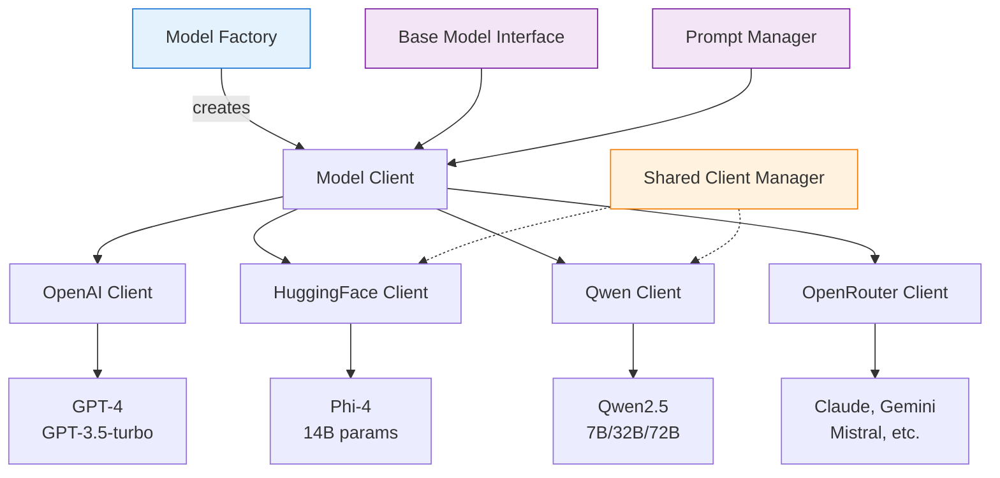
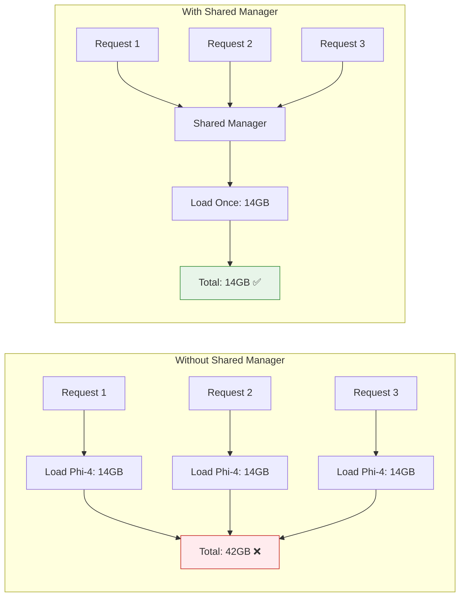

# Model Architecture

GPT_AITIS implements a flexible multi-model architecture that supports both cloud-based APIs and local deployment of large language models. The system uses a factory pattern to provide a unified interface across different model providers.

## Architecture Diagram


### **Key Architectural Difference: Model Client vs Shared Client Manager**

<table>
<tr>
<th>Component</th>
<th>Model Client</th>
<th>Shared Client Manager</th>
</tr>
<tr>
<td><b>Purpose</b></td>
<td>Interface wrapper for model communication</td>
<td>Memory optimizer for local models</td>
</tr>
<tr>
<td><b>Responsibility</b></td>
<td>• Prompt formatting<br>• Response parsing<br>• API communication<br>• Error handling</td>
<td>• Model lifecycle management<br>• GPU memory optimization<br>• Instance sharing<br>• Resource cleanup</td>
</tr>
<tr>
<td><b>API Models</b><br>(OpenAI, OpenRouter)</td>
<td>✅ Lightweight configuration only<br>✅ Stateless HTTP requests</td>
<td>❌ Not needed<br>No models to manage</td>
</tr>
<tr>
<td><b>Local Models</b><br>(HuggingFace, Qwen)</td>
<td>✅ Handles inference calls<br>⚠️ References shared model</td>
<td>✅ Loads model once<br>✅ Shares across all clients</td>
</tr>
</table>

### **Memory Management Example**



**Result**: Hundreds of queries processed with only one model load!

## Model Providers

###  **OpenAI Models**

**Supported Models:**

- GPT-4 (8K/32K context)
- GPT-3.5-turbo (4K/16K context)

**Configuration:**
```python
{
    "temperature": 0.1,
    "max_tokens": 4096,
    "response_format": {"type": "json_object"},
    "seed": 42
}
```

### **HuggingFace Models**

**Supported Models:**

- Microsoft Phi-4 (14B)
- Custom fine-tuned models

**Configuration:**
```python
{
    "torch_dtype": torch.bfloat16,
    "device_map": "auto",
    "trust_remote_code": True,
    "max_new_tokens": 800,
    "temperature": 0.1
}
```

### **Qwen Models**

**Supported Models:**

- Qwen2.5-7B-Instruct
- Qwen2.5-32B-Instruct
- Qwen2.5-72B-Instruct

**Configuration:**
```python
{
    "torch_dtype": "auto",
    "device_map": "auto",
    "max_new_tokens": 2048,
    "temperature": 0.1
}
```

### **OpenRouter Models**

**Supported Models:**

- Claude 3 (Opus/Sonnet)
- Google Gemini Pro
- Mistral Large
- 50+ other models

**Configuration:**
```python
{
    "temperature": 0.1,
    "max_tokens": 4096,
    "top_p": 0.95,
    "provider_preferences": ["anthropic", "google"]
}
```

## Core Components

### **Base Model Interface**

```python
class BaseModel(ABC):
    @abstractmethod
    def generate(self, prompt: str, **kwargs) -> str:
        """Generate response from prompt"""
        pass
    
    @abstractmethod
    def generate_json(self, prompt: str, **kwargs) -> Dict:
        """Generate structured JSON response"""
        pass
    
    @abstractmethod
    def get_token_count(self, text: str) -> int:
        """Count tokens in text"""
        pass
```

### **Model Factory**

```python
class ModelFactory:
    """Creates model instances based on provider"""
    
    @staticmethod
    def create_model(provider: str, model_name: str) -> BaseModel:
        if provider == "openai":
            return OpenAIModel(model_name)
        elif provider == "hf":
            return HuggingFaceModel(model_name)
        elif provider == "qwen":
            return QwenModel(model_name)
        elif provider == "openrouter":
            return OpenRouterModel(model_name)
```

### **Shared Client Manager**

Optimizes memory usage for local models:

```python
class SharedClientManager:
    """Manages shared model instances"""
    
    _instances = {}
    
    @classmethod
    def get_or_create(cls, model_name: str, config: Dict):
        if model_name not in cls._instances:
            cls._instances[model_name] = cls._load_model(model_name, config)
        return cls._instances[model_name]
```

### **Prompt Manager**

Handles prompt templates and formatting:

```python
class PromptManager:
    """Manages prompt templates and formatting"""
    
    def format_insurance_prompt(self, 
                              question: str,
                              context: str,
                              persona: Optional[Dict] = None) -> str:
        """Format prompt for insurance analysis"""
        
    def format_verification_prompt(self,
                                 original_response: Dict,
                                 policy_text: str) -> str:
        """Format prompt for response verification"""
```

## Advanced Features

### **Adaptive Token Management**

```python
def adaptive_context_window(model: BaseModel, 
                          question: str,
                          chunks: List[str]) -> List[str]:
    """Dynamically adjust context based on token limits"""
    
    max_tokens = model.get_max_context_length()
    question_tokens = model.get_token_count(question)
    
    selected_chunks = []
    current_tokens = question_tokens + RESPONSE_BUFFER
    
    for chunk in chunks:
        chunk_tokens = model.get_token_count(chunk)
        if current_tokens + chunk_tokens < max_tokens:
            selected_chunks.append(chunk)
            current_tokens += chunk_tokens
        else:
            break
    
    return selected_chunks
```

### **Fallback Mechanism**

```python
class ModelWithFallback:
    """Provides automatic fallback to alternative models"""
    
    def __init__(self, primary: BaseModel, fallback: BaseModel):
        self.primary = primary
        self.fallback = fallback
    
    def generate(self, prompt: str, **kwargs) -> str:
        try:
            return self.primary.generate(prompt, **kwargs)
        except Exception as e:
            logger.warning(f"Primary model failed: {e}")
            return self.fallback.generate(prompt, **kwargs)
```

### **Response Validation**

```python
class ResponseValidator:
    """Validates model outputs"""
    
    def validate_insurance_response(self, response: Dict) -> bool:
        required_fields = ["outcome", "justification"]
        
        # Check structure
        if not all(field in response for field in required_fields):
            return False
        
        # Check outcome format
        if response["outcome"] not in ["yes", "no"]:
            return False
        
        # Check justification quality
        if len(response["justification"]) < 20:
            return False
        
        return True
```

## Configuration Examples

### OpenAI Configuration
```python
OPENAI_CONFIG = {
    "api_key": os.getenv("OPENAI_API_KEY"),
    "organization": os.getenv("OPENAI_ORG_ID"),
    "model_configs": {
        "gpt-4": {
            "temperature": 0.1,
            "max_tokens": 4096,
            "response_format": {"type": "json_object"}
        }
    }
}
```

### Local Model Configuration
```python
LOCAL_MODEL_CONFIG = {
    "cache_dir": "/models/huggingface/",
    "device_map": "auto",
    "load_in_8bit": False,
    "torch_dtype": torch.bfloat16,
    "use_flash_attention": True
}
```

### Prompt Configuration
```python
PROMPT_CONFIG = {
    "insurance_v15": {
        "system_prompt": "You are an insurance policy expert...",
        "response_format": "json",
        "max_examples": 2
    },
    "verification_v3": {
        "system_prompt": "Verify the insurance decision...",
        "response_format": "json"
    }
}
```