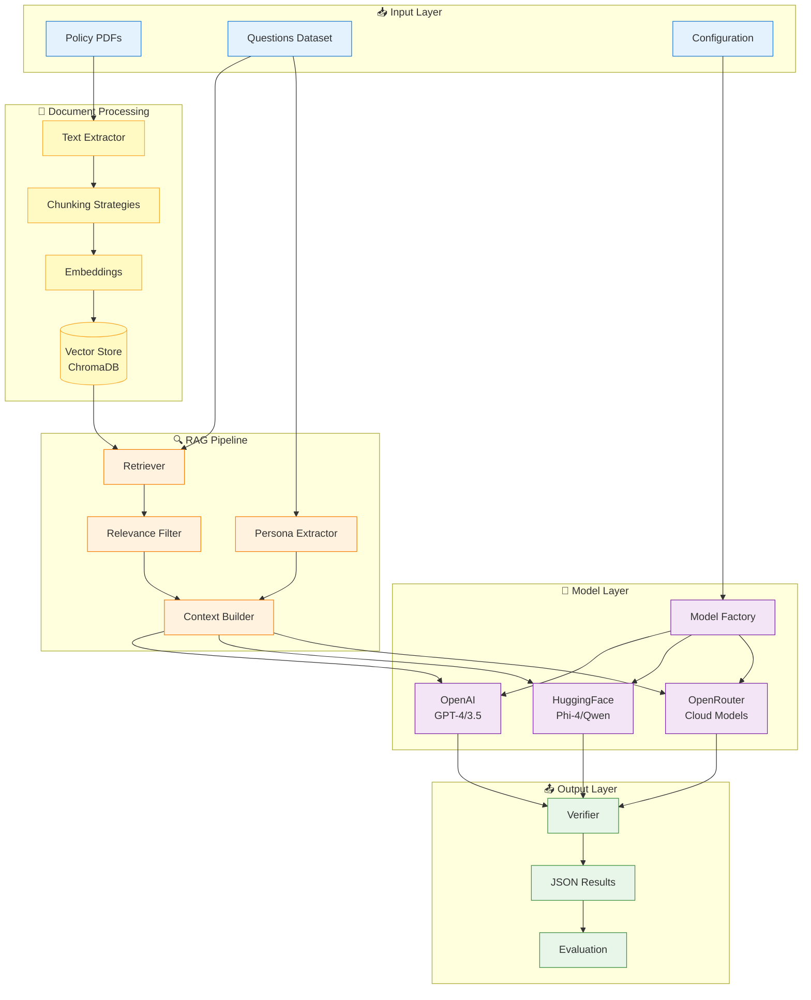
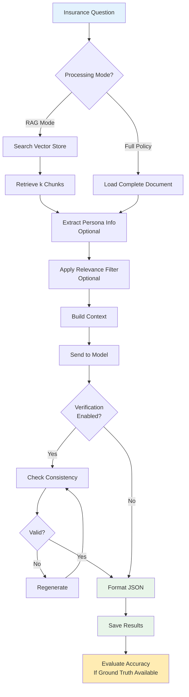

# GPT_AITIS Architecture Overview

## System Architecture



### Understanding the Architecture Flow

The diagram shows how GPT_AITIS processes insurance queries through distinct phases:

**1. Document Indexing (One-time setup):**

- Policy PDFs → Text Extractor → Chunking Strategies → Embeddings → Vector Store
- This happens once when policies are loaded into the system
- Creates searchable chunks stored in ChromaDB

**2. Query Processing (Per question):**

- Question enters the RAG Pipeline
- Retriever searches Vector Store for relevant chunks
- Persona Extractor identifies who/where/when from the question
- Relevance Filter removes unrelated chunks (optional)
- Context Builder assembles the final prompt

**3. Model Inference:**

- Model Factory selects the appropriate model based on configuration
- Context + Question sent to selected model (OpenAI, HuggingFace, or OpenRouter)
- Model generates coverage decision and justification

**4. Output Processing:**

- Verifier checks response validity and consistency
- Results formatted as JSON
- Evaluation compares against ground truth (if available)

## Core Components

### 📥 **Input Layer**
The system accepts three types of inputs that work together:

- **Policy PDFs**: Insurance policy documents that are processed once and stored in the vector database. These contain the rules, coverage details, exclusions, and conditions.
- **Questions Dataset**: Excel or JSON files containing insurance coverage queries like "Is my laptop covered if stolen from my hotel room?" Each question is processed individually through the RAG pipeline.
- **Configuration**: Settings that control model selection (GPT-4 vs Phi-4), chunking strategy (semantic vs simple), number of chunks to retrieve (k=3,5,7), and whether to use verification or persona extraction.

### 📄 **Document Processing** 
This subsystem runs once when new policies are added to the system:

1. **Text Extractor**: Converts PDF files to clean text, handling formatting, tables, and multi-column layouts
2. **Chunking Strategies**: Breaks documents into searchable segments using one of 7 strategies:
    - Simple (fixed size), Section (structure-aware), Smart Size (adaptive), Semantic (meaning-based), Graph (entity-aware)
3. **Embeddings**: Converts text chunks into numerical vectors using sentence transformers
4. **Vector Store (ChromaDB)**: Stores chunks with their embeddings for fast similarity search

### 🔍 **RAG Pipeline**
The core query processing engine that runs for each question:

1. **Retriever**: Searches the vector store for the k most relevant chunks based on semantic similarity to the question
2. **Persona Extractor**: Analyzes the question to identify:
    - Who is making the claim (policyholder, spouse, dependent)
    - Where the incident occurred (location extraction)
    - Any temporal aspects (when it happened)
3. **Relevance Filter** (Optional): Secondary pass to remove chunks that don't help answer the specific question
4. **Context Builder**: Assembles the final prompt by combining the question, retrieved chunks, and any extracted metadata

### 🤖 **Model Layer**
Flexible model selection system:

- **Model Factory**: Selects and initializes the appropriate model based on configuration
- **OpenAI**: Cloud-based GPT-4 or GPT-3.5-turbo via API (highest accuracy, requires API key)
- **HuggingFace**: Locally-hosted models like Phi-4 or Qwen (no API costs, requires GPU)
- **OpenRouter**: Unified API for multiple cloud models (Claude, Gemini, Mistral)

### 📤 **Output Layer**
Post-processing and quality assurance:

- **Verifier**: Two-pass system that checks if the model's answer is consistent with the retrieved policy text and corrects any errors
- **JSON Results**: Structured output containing:
    - Coverage decision (yes/no)
    - Justification with specific policy references
    - Payment/reimbursement details if applicable
- **Evaluation**: Compares model outputs against human-annotated ground truth to calculate accuracy, IoU scores, and confusion matrices

## Key Features

### 🎯 **Smart Chunking**
The system intelligently breaks down insurance policies using 7 different strategies, each optimized for different document types and query patterns:

- **Simple**: Divides text into fixed-size chunks (e.g., 200 words). Fast but may split related information.
- **Section**: Recognizes document structure (headers, sections, articles). Keeps related provisions together.
- **Smart Size**: Adapts chunk size based on content importance - larger chunks for critical sections like exclusions.
- **Semantic**: Groups sentences with similar meaning together using AI embeddings.
- **Graph**: Maps entities and relationships (e.g., "coverage" linked to "exclusions").
- **Semantic Graph**: Combines semantic similarity with entity relationships.
- **Hybrid**: Automatically selects the best strategy for each document section.

### 🔍 **RAG Pipeline Process**
The Retrieval-Augmented Generation pipeline processes each insurance question:

1. **Retrieve**: Searches the vector database for the k most relevant policy chunks (typically k=3 or 5)
2. **Filter**: Optionally removes chunks that don't help answer the specific question
3. **Extract**: Identifies key information from the question:
    - Who is claiming (policyholder vs family member)
    - Where the incident occurred (important for travel insurance)
    - Type of claim (medical, theft, cancellation, etc.)
4. **Generate**: Sends the question + relevant policy chunks to the LLM for decision

### ✅ **Verification System**
A two-pass system ensures accuracy:

- **First Pass**: Model provides initial answer with justification
- **Verification Pass**: System checks if the justification actually supports the decision
- **Correction**: If inconsistencies found, the model re-evaluates with specific guidance
- **Validation**: Ensures output follows required JSON format with all fields

## Processing Flow



### Processing Flow Explanation

**1. Input Processing**

- System receives an insurance question (e.g., "Is theft covered in Spain?")
- Determines processing mode based on configuration

**2. Document Retrieval**

- **RAG Mode**: Searches vector store for relevant chunks using semantic similarity
- **Full Policy Mode**: Loads entire policy document (for models with large context windows)

**3. Context Enhancement**

- Extracts persona information (who's claiming, where incident occurred)
- Optionally filters out irrelevant chunks to reduce noise
- Builds final context combining question + relevant policy text

**4. Model Inference**

- Sends formatted prompt to selected model (GPT-4, Phi-4, etc.)
- Model analyzes policy text and generates coverage decision

**5. Quality Assurance**

- If verification enabled, checks that justification supports the decision
- Re-generates if inconsistencies detected
- Formats response as structured JSON

**6. Output & Evaluation**

- Saves results with timestamp and configuration
- If ground truth available, calculates accuracy metrics

## Output Structure

```json
{
  "policy_id": "travel_insurance_01",
  "question": "Is theft covered while traveling?",
  "outcome": "yes",
  "justification": "Section 4.2: Theft of personal belongings is covered up to $2,500 per incident",
  "payment": "$2,500 maximum per claim, $100 deductible",
  "confidence": 0.95,
  "chunks_used": 3
}
```

## Usage Modes

### 🚀 **Single Query**
```bash
python src/main.py --model openai --model-name gpt-4 --rag-strategy semantic
```

### 📦 **Batch Processing**
```bash
python src/main.py --model hf --model-name microsoft/phi-4 --batch --k 5
```

### 🔬 **Research Mode**
```bash
python src/main.py --rag-strategy semantic_graph --verify --use-persona --filter-irrelevant
```
