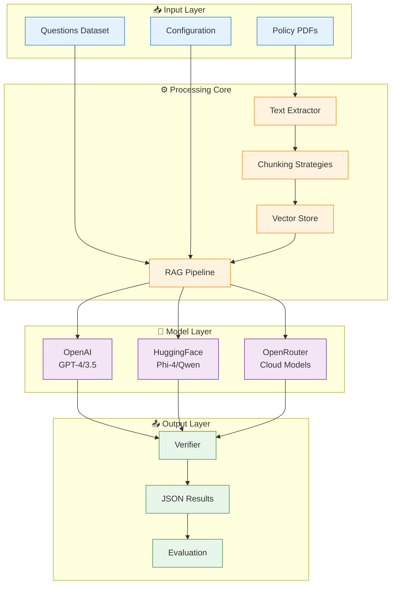
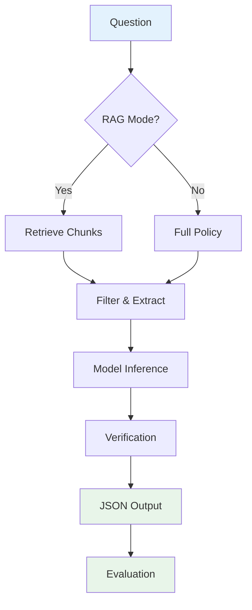

# GPT_AITIS Architecture Overview

## System Architecture



## Core Components

### 📥 **Input Layer**
- **Policy PDFs**: Insurance policy documents to analyze
- **Questions Dataset**: Excel/JSON files with coverage queries
- **Configuration**: Model selection, prompts, and processing parameters

### ⚙️ **Processing Core**
- **Text Extractor**: Converts PDFs to processable text
- **Chunking Strategies**: 7 strategies (Simple, Section, Smart Size, Semantic, Graph, Semantic Graph, Hybrid)
- **Vector Store**: ChromaDB-based embeddings for similarity search
- **RAG Pipeline**: Orchestrates retrieval and analysis flow

### 🤖 **Model Layer**
- **OpenAI**: GPT-4, GPT-3.5-turbo via API
- **HuggingFace**: Local models (Phi-4, Qwen) with GPU support
- **OpenRouter**: Cloud access to various LLMs

### 📤 **Output Layer**
- **Verifier**: Multi-pass validation and error correction
- **JSON Results**: Structured output with coverage decisions
- **Evaluation**: Metrics calculation against ground truth

## Key Features

### 🎯 **Smart Chunking**
The system offers 7 intelligent chunking strategies to handle different document structures:
- **Simple**: Basic fixed-size chunks
- **Section**: Structure-aware segmentation
- **Smart Size**: Adaptive sizing based on content importance
- **Semantic**: Embedding-based coherent segments
- **Graph**: Entity-relationship aware chunking
- **Semantic Graph**: Hybrid semantic-graph approach
- **Hybrid**: Combined strategy for maximum accuracy

### 🔍 **RAG Pipeline**
1. **Retrieve** relevant policy sections (k=1,3,5 chunks)
2. **Filter** irrelevant information
3. **Extract** personas (claimant, location, relationships)
4. **Generate** coverage decision with justification

### ✅ **Verification System**
- Two-pass verification to ensure accuracy
- Validates responses against policy text
- Corrects inconsistencies automatically

## Processing Flow



## Output Structure

```json
{
  "policy_id": "travel_insurance_01",
  "question": "Is theft covered while traveling?",
  "outcome": "yes",
  "justification": "Section 4.2: Theft of personal belongings is covered up to $2,500 per incident",
  "payment": "$2,500 maximum per claim, $100 deductible",
}
```

## Usage Modes

### 🚀 **Single Query**
```bash
python src/main.py --model openai --model-name gpt-4 --rag-strategy semantic
```

### 📦 **Batch Processing**
```bash
python src/main.py --model hf --model-name microsoft/phi-4 --batch --k 5
```

### 🔬 **Research Mode**
```bash
python src/main.py --rag-strategy semantic_graph --verify --use-persona --filter-irrelevant
```
