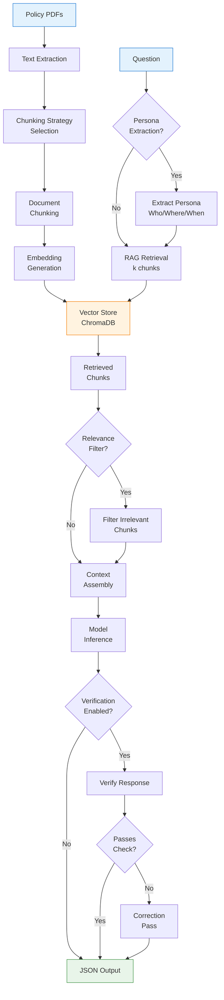

# RAG Pipeline Architecture

The Retrieval-Augmented Generation (RAG) pipeline in GPT_AITIS is designed specifically for insurance policy analysis. It intelligently retrieves relevant policy sections to answer coverage questions, combining multiple chunking strategies with advanced filtering and verification mechanisms.

## Pipeline Architecture



The RAG pipeline diagram shows the complete flow of how GPT_AITIS processes insurance questions. Let me explain the key paths:

**Document Processing Path (Left side - one-time setup):**

- Policy PDFs → Text Extraction → Chunking Strategy Selection → Document Chunking → Embedding Generation → Vector Store
- This happens once when policies are loaded into the system, creating a searchable database of policy chunks

**Query Processing Path (Center - per question):**

- Question enters the system and optionally goes through Persona Extraction (extracting who/where/when information)
- The RAG Retrieval component queries the Vector Store to find the k most relevant chunks
- Retrieved chunks optionally pass through a Relevance Filter to remove noise
- Context Assembly combines the filtered chunks into a coherent prompt

**Generation and Verification Path (Right side):**

- Model Inference generates an initial answer based on the assembled context
- If verification is enabled, the system checks if the response is valid
- Failed checks trigger a Correction Pass where the model regenerates with guidance
- Final output is formatted as JSON

The diagram uses decision diamonds (Persona Extraction?, Relevance Filter?, Verification Enabled?, Passes Check?) to show optional components that can be enabled/disabled based on configuration. The color coding indicates input sources (blue), processing components (orange), storage (yellow), and output (green).

The key insight is that this is actually two separate workflows: document indexing (happens once) and query processing (happens for each question), with the Vector Store serving as the bridge between them.

## Core Components

### 📄 **Document Processing**

**Text Extraction**
```python
def extract_text_from_pdf(pdf_path: str) -> str:
    """Extract text from insurance policy PDFs"""
    # Handles multi-page documents
    # Preserves structure (sections, tables)
    # Cleans formatting artifacts
```

**Chunking Engine**

- **4 Strategies Available**: Simple, Section, Smart Size, Semantic
- **Configurable Parameters**: Chunk size, overlap, coherence thresholds

### **Retrieval System**

**Vector Store Architecture**
```python
class EnhancedLocalVectorStore:
    def __init__(self, chunking_strategy: str = "smart_size"):
        self.client = chromadb.Client()
        self.collection = self.create_collection()
        self.chunking_strategy = ChunkingFactory.create(chunking_strategy)
    
    def index_documents(self, documents: List[str]):
        """Process and index policy documents"""
        # 1. Chunk documents using selected strategy
        # 2. Generate embeddings
        # 3. Store in ChromaDB with metadata
    
    def retrieve(self, query: str, k: int = 5) -> List[Dict]:
        """Retrieve k most relevant chunks"""
        # 1. Embed query
        # 2. Similarity search
        # 3. Return ranked chunks with metadata
```

### **Persona Extraction**

Identifies key entities in insurance queries:

```python
class PersonaExtractor:
    def extract(self, query: str) -> Dict:
        return {
            "claimant": "first_person",      # Who is claiming
            "affected_party": "spouse",       # Who is affected  
            "location": "Switzerland",        # Where it happened
            "relationship": "policyholder"    # Relationship to policy
        }

# Example:
# Query: "My wife had an accident in Switzerland, is she covered?"
# Extracted: {claimant: "first_person", affected_party: "spouse", 
#            location: "Switzerland", relationship: "spouse"}
```

### **Relevance Filtering**

Optional secondary filtering to improve precision:

```python
def filter_irrelevant_chunks(model, query: str, chunks: List[Dict]) -> List[Dict]:
    """Use model to identify truly relevant chunks"""
    
    prompt = f"""
    Query: {query}
    
    Review these chunks and identify which contain information 
    that directly helps answer the query.
    
    Chunks:
    {format_chunks(chunks)}
    
    Return indices of relevant chunks.
    """
    
    relevant_indices = model.generate_json(prompt)["relevant_indices"]
    return [chunks[i] for i in relevant_indices]
```

### **Context Assembly**

Optimizes context window usage:

```python
def assemble_context(chunks: List[Dict], 
                    max_tokens: int,
                    query_tokens: int) -> str:
    """Assemble chunks into context within token limits"""
    
    context_parts = []
    used_tokens = query_tokens + RESPONSE_BUFFER
    
    for chunk in chunks:
        chunk_tokens = count_tokens(chunk["text"])
        if used_tokens + chunk_tokens < max_tokens:
            context_parts.append(f"[Policy Section: {chunk['metadata']['section']}]")
            context_parts.append(chunk["text"])
            context_parts.append("---")
            used_tokens += chunk_tokens
        else:
            break
    
    return "\n".join(context_parts)
```

## Pipeline Configurations

### **Speed-Optimized Pipeline**
```python
# Configuration for fast processing
SPEED_CONFIG = {
    "chunking_strategy": "simple",
    "k": 3,
    "use_persona": False,
    "filter_irrelevant": False,
    "verify": False,
    "model": "gpt-3.5-turbo"
}
```

### **Accuracy-Optimized Pipeline**
```python
# Configuration for maximum accuracy
ACCURACY_CONFIG = {
    "chunking_strategy": "semantic_graph",
    "k": 7,
    "use_persona": True,
    "filter_irrelevant": True,
    "verify": True,
    "model": "gpt-4"
}
```

### **Balanced Pipeline**
```python
# Configuration for production use
BALANCED_CONFIG = {
    "chunking_strategy": "smart_size",
    "k": 5,
    "use_persona": True,
    "filter_irrelevant": False,
    "verify": True,
    "model": "microsoft/phi-4"
}
```

## Advanced Features

### **Adaptive Retrieval**

```python
class AdaptiveRetriever:
    """Dynamically adjusts retrieval based on query complexity"""
    
    def determine_k(self, query: str) -> int:
        """Determine optimal number of chunks"""
        complexity_indicators = [
            "multiple", "various", "different scenarios",
            "exceptions", "special cases", "conditions"
        ]
        
        # More complex queries need more context
        if any(ind in query.lower() for ind in complexity_indicators):
            return 7
        elif "?" in query and len(query) > 100:
            return 5
        else:
            return 3
    
    def adjust_strategy(self, query: str, doc_type: str) -> str:
        """Select best chunking strategy"""
        if "definition" in query.lower():
            return "section"  # Likely in specific sections
        elif "amount" in query or "$" in query:
            return "smart_size"  # Financial info emphasis
        else:
            return "semantic"  # General coherence
```

### **Query Enhancement**

```python
def enhance_query_with_metadata(query: str, 
                               persona: Dict,
                               policy_type: str) -> str:
    """Enhance query with extracted metadata"""
    
    enhanced = query
    
    if persona.get("location"):
        enhanced += f" (Location: {persona['location']})"
    
    if persona.get("relationship"):
        enhanced += f" (Claimant: {persona['relationship']})"
    
    # Add policy-specific context
    if policy_type == "travel":
        enhanced += " Consider travel-specific exclusions."
    
    return enhanced
```

### **Retrieval Analytics**

```python
class RetrievalAnalytics:
    """Track and analyze retrieval performance"""
    
    def analyze_retrieval(self, query: str, 
                         chunks: List[Dict],
                         response: Dict) -> Dict:
        return {
            "chunks_retrieved": len(chunks),
            "avg_similarity": np.mean([c["score"] for c in chunks]),
            "sections_covered": list(set(c["metadata"]["section"] for c in chunks)),
            "response_confidence": self._calculate_confidence(response),
            "tokens_used": sum(count_tokens(c["text"]) for c in chunks)
        }
```

## Performance Optimization

### **Caching Strategy**

```python
class RAGCache:
    """Cache retrieval results for common queries"""
    
    def __init__(self, ttl: int = 3600):
        self.cache = {}
        self.ttl = ttl
    
    def get_or_retrieve(self, query: str, retriever, k: int):
        cache_key = f"{query}:{k}"
        
        if cache_key in self.cache:
            if not self._is_expired(cache_key):
                return self.cache[cache_key]["chunks"]
        
        # Retrieve and cache
        chunks = retriever.retrieve(query, k)
        self.cache[cache_key] = {
            "chunks": chunks,
            "timestamp": time.time()
        }
        return chunks
```

### **Batch Processing**

```python
def batch_rag_pipeline(questions: List[str], 
                      policy_id: str,
                      config: Dict) -> List[Dict]:
    """Process multiple questions efficiently"""
    
    # 1. Index policy once
    vector_store = index_policy(policy_id, config["chunking_strategy"])
    
    # 2. Batch retrieve if possible
    all_chunks = {}
    for q in questions:
        if q not in all_chunks:
            all_chunks[q] = vector_store.retrieve(q, config["k"])
    
    # 3. Process with shared model instance
    model = ModelFactory.create(config["model"])
    results = []
    
    for q in questions:
        context = assemble_context(all_chunks[q])
        result = model.generate(q, context)
        results.append(result)
    
    return results
```

## Best Practices

1. **Start Simple**: Begin with simple chunking and k=3
2. **Measure Impact**: Use evaluation metrics to guide improvements
3. **Profile Performance**: Monitor retrieval times and accuracy
4. **Iterate Strategies**: Test multiple chunking strategies on your data
5. **Cache Wisely**: Cache common queries but invalidate on updates
6. **Monitor Resources**: Track GPU memory and API usage
7. **Validate Results**: Always verify critical decisions