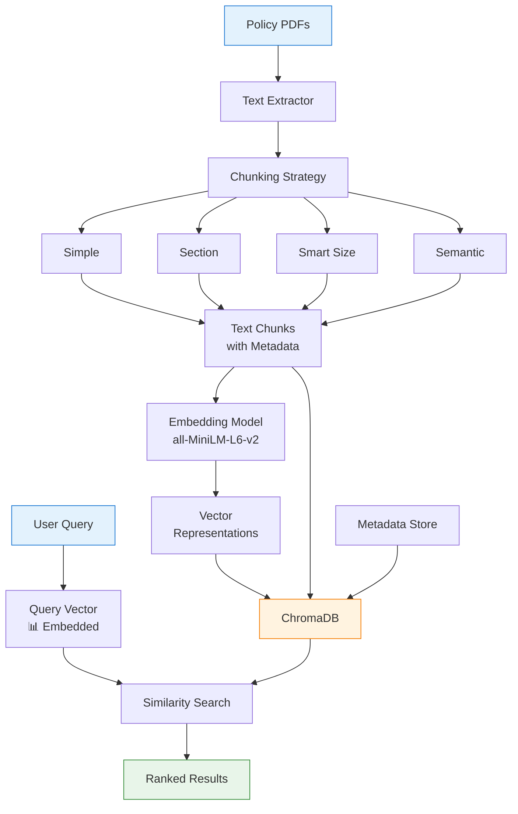

# Vector Store Architecture

The Vector Store is the semantic search engine at the heart of GPT_AITIS's RAG pipeline. It transforms insurance policy documents into searchable embeddings, enabling intelligent retrieval of relevant policy sections for coverage analysis.

## Architecture Diagram



## Core Components

### **ChromaDB Integration**

```python
class EnhancedLocalVectorStore:
    """Enhanced vector store with multiple chunking strategies"""
    
    def __init__(self, 
                 chunking_strategy: str = "smart_size",
                 chunking_config: Optional[Dict[str, Any]] = None,
                 embedding_model: str = "all-MiniLM-L6-v2"):
        
        # Initialize ChromaDB
        self.client = chromadb.Client(Settings(
            chroma_db_impl="duckdb+parquet",
            persist_directory=".chroma",
            anonymized_telemetry=False
        ))
        
        # Create collection with metadata
        self.collection = self.client.create_collection(
            name=f"insurance_docs_{chunking_strategy}",
            metadata={
                "strategy": chunking_strategy,
                "embedding_model": embedding_model,
                "created_at": datetime.now().isoformat()
            }
        )
        
        # Initialize chunking strategy
        self.chunking_strategy = ChunkingFactory.create_strategy(
            chunking_strategy, 
            chunking_config or {}
        )
        
        # Initialize embedding model
        self.embedder = SentenceTransformer(embedding_model)
```

### **Data Model**

```python
@dataclass
class ChunkMetadata:
    """Metadata for each chunk"""
    chunk_id: str               # Unique identifier
    document_id: str            # Source document
    policy_type: str           # travel, health, etc.
    section_title: str         # Section heading
    page_number: int           # Original page
    chunk_index: int           # Position in document
    chunk_type: str            # text, table, list
    importance_score: float    # 0-1 importance rating
    has_monetary_value: bool   # Contains amounts
    has_dates: bool           # Contains dates
    entities: List[str]       # Named entities
    keywords: List[str]       # Key terms
    
@dataclass
class TextChunk:
    """Text chunk with metadata"""
    text: str
    metadata: ChunkMetadata
    embedding: Optional[np.ndarray] = None
    token_count: int = 0
```

### **Embedding Pipeline**

```python
class EmbeddingPipeline:
    """Manages document embedding process"""
    
    def __init__(self, model_name: str = "all-MiniLM-L6-v2"):
        self.model = SentenceTransformer(model_name)
        self.dimension = self.model.get_sentence_embedding_dimension()
    
    def embed_chunks(self, chunks:ളList[TextChunk], 
                    batch_size: int = 32) -> List[TextChunk]:
        """Generate embeddings for chunks"""
        
        texts = [chunk.text for chunk in chunks]
        
        # Batch processing for efficiency
        embeddings = []
        for i in range(0, len(texts), batch_size):
            batch = texts[i:i + batch_size]
            batch_embeddings = self.model.encode(
                batch,
                normalize_embeddings=True,
                show_progress_bar=True
            )
            embeddings.extend(batch_embeddings)
        
        # Attach embeddings to chunks
        for chunk, embedding in zip(chunks, embeddings):
            chunk.embedding = embedding
            
        return chunks
```

## Storage Architecture

### **Collection Structure**

The storage architecture organizes insurance policy data into structured collections within ChromaDB. Each collection represents a specific chunking strategy, allowing for easy experimentation and comparison. The schema is designed to support both dense vector search and metadata filtering, crucial for insurance-specific queries like "find coverage limits for medical expenses in European travel policies."


```python
# Collection schema in ChromaDB
COLLECTION_SCHEMA = {
    "name": "insurance_policies",
    "embedding_function": "sentence-transformers",
    "metadata": {
        "description": "Insurance policy chunks with semantic search",
        "chunking_strategies": ["simple", "section", "smart_size", ...],
        "embedding_dimension": 384
    }
}

# Document storage format
DOCUMENT_FORMAT = {
    "id": "policy_travel_01_chunk_42",
    "embedding": [0.1, 0.2, ...],  # 384-dimensional vector
    "document": "Coverage for medical expenses...",
    "metadata": {
        "document_id": "policy_travel_01",
        "section": "Medical Coverage",
        "page": 15,
        "importance": 0.85,
        "has_amounts": True
    }
}
```

### **Indexing Strategy**

The indexing process transforms raw policy documents into searchable chunks with rich metadata. This multi-stage pipeline ensures that each chunk contains enough context for accurate retrieval while maintaining coherence and relevance. The strategy adapts based on document type and content characteristics.

```python
def index_documents(self, documents: List[str], 
                   policy_type: str = "general") -> Dict[str, Any]:
    """Index documents with optimized strategy"""
    
    stats = {
        "total_documents": len(documents),
        "total_chunks": 0,
        "avg_chunk_size": 0,
        "indexing_time": 0
    }
    
    start_time = time.time()
    
    for doc_path in documents:
        # Extract text
        text = extract_text(doc_path)
        doc_id = Path(doc_path).stem
        
        # Chunk document
        chunks = self.chunking_strategy.chunk(text, doc_id)
        
        # Enhance with metadata
        chunks = self._enhance_metadata(chunks, policy_type)
        
        # Generate embeddings
        chunks = self.embedding_pipeline.embed_chunks(chunks)
        
        # Store in ChromaDB
        self._store_chunks(chunks)
        
        stats["total_chunks"] += len(chunks)
    
    stats["indexing_time"] = time.time() - start_time
    stats["avg_chunk_size"] = stats["total_chunks"] / len(documents)
    
    return stats
```

## Retrieval System

### **Similarity Search**

The similarity converts user queries into vectors and finding the most semantically similar chunks from the insurance policies. It uses cosine similarity to measure the angular distance between query and document embeddings.

```python
class SemanticRetriever:
    """Advanced retrieval with multiple strategies"""
    
    def retrieve(self, 
                query: str, 
                k: int = 5,
                filter_criteria: Optional[Dict] = None) -> List[Dict]:
        """Retrieve k most relevant chunks"""
        
        # Embed query
        query_embedding = self.embedder.encode(
            query,
            normalize_embeddings=True
        )
        
        # Build filter
        where_clause = self._build_filter(filter_criteria)
        
        # Search
        results = self.collection.query(
            query_embeddings=[query_embedding.tolist()],
            n_results=k,
            where=where_clause,
            include=["documents", "metadatas", "distances"]
        )
        
        # Format results
        chunks = []
        for i in range(len(results['documents'][0])):
            chunks.append({
                'text': results['documents'][0][i],
                'metadata': results['metadatas'][0][i],
                'score': 1 - results['distances'][0][i],  # Convert distance to similarity
                'rank': i + 1
            })
        
        return self._post_process_results(chunks)
```

### **Advanced Retrieval Features**

These features address common challenges like terminology variations, context dependencies, and the need to balance keyword precision with semantic understanding.

```python
class AdvancedRetriever:
    """Enhanced retrieval capabilities"""
    
    def hybrid_search(self, 
                     query: str,
                     k: int = 5,
                     alpha: float = 0.5) -> List[Dict]:
        """Combine semantic and keyword search"""
        
        # Semantic search
        semantic_results = self.semantic_search(query, k * 2)
        
        # Keyword search
        keyword_results = self.keyword_search(query, k * 2)
        
        # Merge with weighted scores
        merged = self._merge_results(
            semantic_results, 
            keyword_results,
            alpha  # Weight for semantic vs keyword
        )
        
        return merged[:k]
    
    def contextual_retrieval(self, 
                           query: str,
                           context: List[str],
                           k: int = 5) -> List[Dict]:
        """Retrieve considering previous context"""
        
        # Combine query with context
        enhanced_query = self._build_contextual_query(query, context)
        
        # Retrieve with boosted relevant sections
        results = self.retrieve(
            enhanced_query,
            k=k,
            boost_sections=self._extract_relevant_sections(context)
        )
        
        return results
```

### **Ranking Algorithms**

The ranking algorithms refine initial retrieval results by applying more sophisticated scoring models. This two-stage approach (retrieve then rerank) balances efficiency with accuracy, using fast approximate search for initial retrieval followed by precise reranking of top candidates.

```python
class RelevanceRanker:
    """Advanced ranking for retrieved chunks"""
    
    def rerank_results(self, 
                      query: str,
                      chunks: List[Dict],
                      strategy: str = "cross-encoder") -> List[Dict]:
        """Rerank results for better precision"""
        
        if strategy == "cross-encoder":
            # Use cross-encoder for precise ranking
            pairs = [(query, chunk['text']) for chunk in chunks]
            scores = self.cross_encoder.predict(pairs)
            
            for chunk, score in zip(chunks, scores):
                chunk['rerank_score'] = score
                
        elif strategy == "importance-weighted":
            # Weight by chunk importance
            for chunk in chunks:
                base_score = chunk['score']
                importance = chunk['metadata'].get('importance', 0.5)
                chunk['rerank_score'] = base_score * (1 + importance * 0.5)
        
        # Sort by new scores
        return sorted(chunks, key=lambda x: x['rerank_score'], reverse=True)
```

## Monitoring & Analytics

### **Performance Metrics**

```python
class VectorStoreMetrics:
    """Track vector store performance"""
    
    def get_statistics(self) -> Dict[str, Any]:
        """Get comprehensive statistics"""
        
        return {
            "storage": {
                "total_chunks": self.collection.count(),
                "total_documents": len(self.get_unique_documents()),
                "avg_chunk_size": self.get_avg_chunk_size(),
                "storage_size_mb": self.get_storage_size()
            },
            "performance": {
                "avg_query_time_ms": self.get_avg_query_time(),
                "cache_hit_rate": self.cache.get_hit_rate(),
                "indexing_speed": self.get_indexing_speed()
            },
            "quality": {
                "avg_similarity_score": self.get_avg_similarity(),
                "coverage": self.calculate_coverage(),
                "chunk_distribution": self.get_chunk_distribution()
            }
        }
```

### **Query Analytics**

```python
def analyze_query_patterns(self, time_window: int = 3600) -> Dict:
    """Analyze search patterns"""
    
    return {
        "top_queries": self.get_top_queries(),
        "avg_results_per_query": self.get_avg_results(),
        "zero_result_queries": self.get_zero_results(),
        "query_topics": self.cluster_queries(),
        "performance_by_strategy": self.compare_strategies()
    }
```

## Configuration

### **Vector Store Settings**

```python
VECTOR_STORE_CONFIG = {
    "embedding": {
        "model": "all-MiniLM-L6-v2",
        "dimension": 384,
        "normalize": True,
        "batch_size": 32
    },
    "storage": {
        "backend": "chromadb",
        "persist_directory": ".chroma",
        "collection_name": "insurance_policies"
    },
    "retrieval": {
        "default_k": 5,
        "similarity_threshold": 0.7,
        "reranking": True,
        "cache_enabled": True
    },
    "chunking": {
        "default_strategy": "smart_size",
        "fallback_strategy": "simple"
    }
}
```

### **Tuning Parameters**

| Parameter | Default | Description | Impact |
|-----------|---------|-------------|--------|
| `chunk_size` | 512 | Tokens per chunk | Larger = more context, fewer chunks |
| `chunk_overlap` | 50 | Token overlap | Higher = better continuity, more storage |
| `similarity_threshold` | 0.7 | Min similarity | Lower = more results, less precision |
