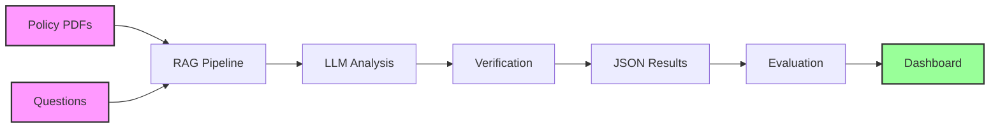

# GPT_AITIS Documentation

Welcome to the comprehensive documentation for **GPT_AITIS** - an advanced system for automated insurance coverage determination using Large Language Models (LLMs) with Retrieval-Augmented Generation (RAG).

## 🎯 What is GPT_AITIS?

GPT_AITIS is a sophisticated AI system designed to analyze insurance policy documents and answer coverage-related questions with precise policy citations. It combines state-of-the-art language models with advanced retrieval techniques to provide accurate, verifiable insurance coverage determinations.

### Key Features

<div class="grid cards" markdown>

- :material-robot: **Multi-Model Support**  
  Works with OpenAI GPT-4, Microsoft Phi-4, Qwen models (local & cloud)

- :material-magnify: **Advanced RAG Strategies**  
  Six different chunking strategies optimized for insurance documents

- :material-check-decagram: **Result Verification**  
  Multi-iteration verification system for improved accuracy

- :material-chart-line: **Comprehensive Evaluation**  
  Built-in evaluation framework with visual analytics

- :material-lightning-bolt: **Production Ready**  
  Batch processing, HPC support, and scalable architecture

</div>

## 📚 Documentation Overview

### For Users

- **[Quick Start Guide](getting-started/quickstart.md)** - Get up and running in 5 minutes
- **[User Guide](user-guide/overview.md)** - Complete guide to using the system
- **[Evaluation Guide](evaluation/overview.md)** - How to evaluate model performance
- **[Scripts Reference](scripts/overview.md)** - Documentation for all utility scripts

### For Developers

- **[Architecture Overview](architecture/overview.md)** - System design and components
- **[Development Guide](development/setup.md)** - Setting up for development
- **[API Reference](api/core.md)** - Complete API documentation
- **[Contributing](development/contributing.md)** - How to contribute to the project

## 🚀 Quick Example

```bash
# Run analysis on insurance policies
python src/main.py \
    --model hf \
    --model-name microsoft/phi-4 \
    --prompt precise_v5 \
    --k 3 \
    --rag-strategy semantic \
    --batch

# Evaluate results against ground truth
python ./src/scripts/evaluate_results.py \
    --models microsoft_phi-4 \
    --json-path ./resources/results/json_output/ \
    --gt-path ./resources/ground_truth/ \
    --output-dir ./resources/results/eval_new/

# Generate performance dashboard
python ./src/scripts/create_dashboard.py \
    --eval-dir ./resources/results/eval_new/ \
    --output ./resources/results/dashboard.html
```

## 📊 System Workflow



## 🏗️ Project Structure

```
GPT_AITIS/
├── src/                      # Source code
│   ├── main.py              # Main entry point
│   ├── models/              # Model implementations
│   ├── prompts/             # Prompt templates
│   └── scripts/             # Utility scripts
├── resources/               # Data and results
│   ├── documents/policies/  # Input PDFs
│   ├── questions/          # Questions Excel
│   ├── ground_truth/       # GT for evaluation
│   └── results/            # All outputs
└── docs/                   # This documentation
```

## 🎯 Use Cases

### Insurance Companies
- Automate policy review and coverage determination
- Reduce manual processing time by 90%
- Ensure consistent decision-making

### Insurance Brokers
- Quick policy comparison across providers
- Instant coverage verification for clients
- Detailed justification for recommendations

### Researchers
- Benchmark LLM performance on domain-specific tasks
- Develop new RAG strategies
- Advance insurance NLP research

## 📈 Performance Metrics

Our evaluation framework tracks:

- **Accuracy**: Overall correctness of eligibility decisions
- **Precision/Recall/F1**: Per-class performance metrics
- **Justification Quality**: IoU and exact match scores for policy citations
- **Payment Accuracy**: Correctness of extracted payment amounts

## 🛠️ Technology Stack

- **Python 3.12+** - Core language
- **PyTorch** - Deep learning framework
- **Transformers** - Model implementations
- **Sentence-Transformers** - Embeddings
- **UV** - Fast Python package manager
- **MkDocs Material** - Documentation

## 📬 Support & Contact

- **Issues**: [GitHub Issues](https://github.com/jean3P/GPT_AITIS/issues)
- **Discussions**: [GitHub Discussions](https://github.com/jean3P/GPT_AITIS/discussions)
- **Email**: jean.2p.principe@gmail.com

## 📄 License

This project is licensed under the MIT License. See [LICENSE](https://github.com/jean3P/GPT_AITIS) for details.

---

<div align="center">
  <strong>Ready to get started?</strong><br>
  <a href="getting-started/installation/" class="md-button md-button--primary">Install GPT_AITIS</a>
  <a href="getting-started/quickstart/" class="md-button">Quick Start Guide</a>
</div>
