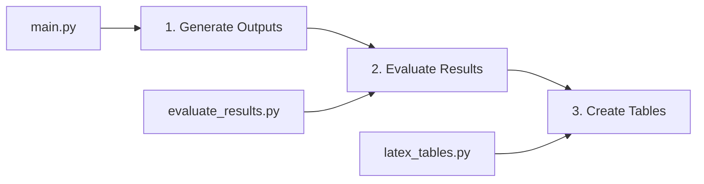

# Scripts Overview

The GPT_AITIS system includes several scripts that support the insurance policy analysis pipeline, from running experiments to evaluating results and generating publication-ready outputs.

## Script Categories

The scripts are organized into three main categories:

1. **Pipeline Scripts**: Core analysis execution
2. **Evaluation Scripts**: Performance assessment and comparison
3. **Utility Scripts**: Supporting tools and helpers

## Core Scripts

### 1. Main Pipeline (`main.py`)

**Purpose**: Primary entry point for running insurance policy analysis.

**Key Features**:

- Multi-model support (OpenAI, HuggingFace, OpenRouter)
- RAG and complete-policy modes
- Batch processing capabilities
- Verification and relevance filtering
- Structured JSON output generation

**Location**: `src/main.py`

**Basic Usage**:
```bash
python src/main.py --model hf --model-name microsoft/phi-4 \
    --prompt precise_v4 --k 3 --batch
```

### 2. Evaluation Script (`evaluate_results.py`)

**Purpose**: Compare model outputs against ground truth annotations.

**Key Features**:

- Multi-model comparison
- Comprehensive metrics calculation
- Flexible filtering (by k, prompt, timestamp)
- Classification analysis
- CSV and JSON output formats

**Location**: `src/scripts/evaluate_results.py`

**Basic Usage**:
```bash
python src/scripts/evaluate_results.py \
    --models microsoft_phi-4 \
    --k 3 --latest
```

### 3. LaTeX Table Generator (`latex_tables.py`)

**Purpose**: Generate publication-ready LaTeX tables from evaluation results.

**Key Features**:

- Individual model tables
- Multi-model comparison tables
- Confusion matrices
- Classification metrics formatting
- Customizable output

**Location**: `src/scripts/latex_tables.py`

**Basic Usage**:
```bash
python src/scripts/latex_tables.py \
    --models phi-4 qwen-2-5-72b-instruct
```

## Script Workflow

The typical workflow involves three stages:



### Stage 1: Generate Model Outputs

Run experiments with different configurations:

```bash
# RAG mode with k=3
python src/main.py --model hf --model-name microsoft/phi-4 \
    --prompt precise_v4 --k 3 --batch

# Complete policy mode
python src/main.py --model hf --model-name microsoft/phi-4 \
    --prompt precise_v4 --complete-policy --batch

# With verification
python src/main.py --model hf --model-name microsoft/phi-4 \
    --prompt precise_v4 --k 3 --batch \
    --verifier --verifier-iterations 1
```

**Output Structure**:
```
resources/results/json_output/
└── microsoft_phi-4/
    └── k=3/
        └── 25-01-25--14-30-00/
            └── precise_v4/
                ├── policy_10_results.json
                ├── policy_18_results.json
                └── ...
```

### Stage 2: Evaluate Performance

Assess model outputs against ground truth:

```bash
# Evaluate latest results
python src/scripts/evaluate_results.py \
    --models microsoft_phi-4 --latest

# Compare multiple models
python src/scripts/evaluate_results.py \
    --models microsoft_phi-4 qwen_qwen-2.5-72b-instruct \
    --k 3 --latest
```

**Output Files**:
```
resources/results/evaluation_results/
└── microsoft_phi-4/
    ├── evaluation_results_k=3_exp_25-01-25--14-30-00_precise_v4_*.csv
    ├── evaluation_summary_k=3_exp_25-01-25--14-30-00_precise_v4_*.json
    └── classification_metrics_k=3_exp_25-01-25--14-30-00_precise_v4_*.json
```

### Stage 3: Generate LaTeX Tables

Create publication-ready tables:

```bash
# Generate all tables
python src/scripts/latex_tables.py \
    --models phi-4 qwen-2-5-72b-instruct

# Comparison tables only
python src/scripts/latex_tables.py \
    --models phi-4 qwen-2-5-72b-instruct \
    --compare-only
```

**Output**: LaTeX file with formatted tables ready for inclusion in papers.

## Script Dependencies

### System Dependencies

```python
# Required packages
pandas          # Data manipulation
numpy           # Numerical operations
scikit-learn    # Classification metrics
editdistance    # String similarity
json            # Data serialization
argparse        # Command-line parsing
```

### Data Dependencies

1. **For main.py**:
    - Policy PDFs in `resources/documents/policies/`
    - Questions in `resources/questions/questions.xlsx`
    - Model weights (local or API access)

2. **For evaluate_results.py**:
    - Model outputs in `resources/results/json_output/`
    - Ground truth in `resources/ground_truth/`

3. **For latex_tables.py**:
    - Evaluation results from `evaluate_results.py`

## Script Configuration

### Environment Variables

Scripts respect configuration from `config.py`:

```python
# Key paths used by scripts
JSON_PATH = "resources/results/json_output/"
GT_PATH = "resources/ground_truth/"
EVALUATION_RESULTS_FILES_PATH = "resources/results/evaluation_results/"
```

### Command-Line Arguments

All scripts use argparse for flexible configuration:

```python
# Common argument patterns
--models        # Specify models to process
--k             # RAG chunk parameter
--prompt        # Prompt template name
--latest        # Use most recent experiment
--date          # Specific experiment date
--output        # Custom output location
```

## Error Handling

### Common Issues and Solutions

1. **Missing Ground Truth**
   ```
   Error: No ground truth files found
   ```
   Solution: Ensure GT files follow naming convention `GT_policy_XX.json`

2. **No Model Outputs**
   ```
   Error: No output files found in model directory
   ```
   Solution: Run `main.py` first to generate outputs

3. **Missing Evaluation Results**
   ```
   Missing evaluation files for LaTeX generation
   ```
   Solution: Run `evaluate_results.py` before `latex_tables.py`

### Debug Mode

Most scripts provide verbose output for debugging:

```bash
# Evaluation script shows detailed file discovery
python src/scripts/evaluate_results.py --models microsoft_phi-4

# Main script with debug logging
python src/main.py --model hf --model-name microsoft/phi-4 \
    --log-level DEBUG
```


## Script Extension

The modular design supports easy extension:

1. **New Metrics**: Add to `evaluate_results.py`
2. **New Table Formats**: Extend `latex_tables.py`
3. **New Models**: Update `main.py` model factory


The script ecosystem provides a complete workflow for insurance policy analysis research, from experimentation through evaluation to publication-ready outputs.