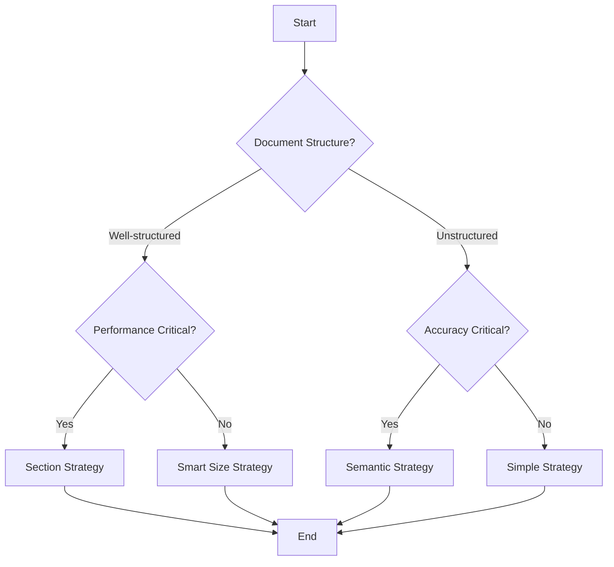

# RAG Strategies

RAG (Retrieval-Augmented Generation) strategies determine how insurance policy documents are chunked and indexed for retrieval. The choice of strategy significantly impacts the quality and accuracy of coverage determinations.

## Available Strategies

GPT_AITIS provides four different RAG strategies, each optimized for different aspects of insurance policy analysis:

### 1. Simple Strategy

The baseline strategy that uses paragraph-based chunking.

```bash
python src/main.py --rag-strategy simple --k 3
```

**Characteristics:**

- Fast and straightforward
- Preserves paragraph boundaries
- Fixed chunk size (default: 512 characters)
- Minimal preprocessing overhead


**Configuration:**
```python
{
    "max_length": 512,
    "overlap": 0,
    "preserve_paragraphs": True
}
```

### 2. Section Strategy

Structural chunking that recognizes document organization (sections, chapters, articles).

```bash
python src/main.py --rag-strategy section --k 3
```

**Characteristics:**

- Preserves document structure
- Recognizes headers like "SECTION A", "ARTICLE 1.2"
- Supports multilingual section markers (English/Italian)
- Maintains legal context integrity

**Configuration:**
```python
{
    "max_section_length": 2000,
    "min_section_length": 50,
    "preserve_subsections": True,
    "include_front_matter": False,
    "sentence_window_size": 3
}
```

### 3. Smart Size Strategy

Adaptive chunking that adjusts size based on content importance.

```bash
python src/main.py --rag-strategy smart_size --k 3
```

**Characteristics:**

- Dynamically adjusts chunk size
- Larger chunks for important content (amounts, conditions)
- Smaller chunks for routine text
- Preserves complete legal clauses

**Configuration:**
```python
{
    "base_chunk_words": 80,
    "min_chunk_words": 20,
    "max_chunk_words": 200,
    "importance_multiplier": 1.5,
    "preserve_complete_clauses": True,
    "overlap_words": 0
}
```

### 4. Semantic Strategy

Uses sentence embeddings to group semantically related content.

```bash
python src/main.py --rag-strategy semantic --k 3
```

**Characteristics:**

- Groups semantically similar sentences
- Uses cosine similarity thresholds
- Maintains topic coherence
- Requires embedding model

**Configuration:**
```python
{
    "embedding_model": "all-MiniLM-L6-v2",
    "breakpoint_threshold_type": "percentile",
    "breakpoint_threshold_value": 75,
    "min_chunk_sentences": 2,
    "max_chunk_sentences": 15,
    "preserve_paragraph_boundaries": True
}
```

## Choosing a Strategy

### Decision Matrix



### Recommendations by Use Case

#### Quick Analysis / Testing
```bash
python src/main.py --rag-strategy simple --k 3
```

#### Production Deployment
```bash
python src/main.py --rag-strategy smart_size --k 5
```

#### Research / Maximum Accuracy
```bash
python src/main.py --rag-strategy semantic --k 7
```

#### Structured Policies
```bash
python src/main.py --rag-strategy section --k 3
```

## Advanced Configuration

### Custom Strategy Configuration

Create a custom configuration file:

```python
# custom_rag_config.py
CUSTOM_SEMANTIC_CONFIG = {
    "embedding_model": "sentence-transformers/all-mpnet-base-v2",
    "breakpoint_threshold_type": "percentile",
    "breakpoint_threshold_value": 85,
    "min_chunk_sentences": 3,
    "max_chunk_sentences": 20,
    "preserve_paragraph_boundaries": True,
    "device": "cuda"  # Use GPU if available
}
```

Use in code:

```python
from models.vector_store import EnhancedLocalVectorStore
from custom_rag_config import CUSTOM_SEMANTIC_CONFIG

vector_store = EnhancedLocalVectorStore(
    chunking_strategy="semantic",
    chunking_config=CUSTOM_SEMANTIC_CONFIG
)
```

### Combining Strategies

You can run multiple strategies and compare results:

```bash
# Run with different strategies
for strategy in simple section smart_size semantic; do
    python src/main.py \
        --model hf \
        --model-name microsoft/phi-4 \
        --rag-strategy $strategy \
        --k 3 \
        --output-dir results/$strategy \
        --batch
done
```

## Next Steps

- Learn about [Prompt Engineering](prompts.md) to optimize model responses
- Explore [Result Verification](verification.md) for quality assurance
- See [Evaluation System](../evaluation/overview.md) to measure strategy effectiveness