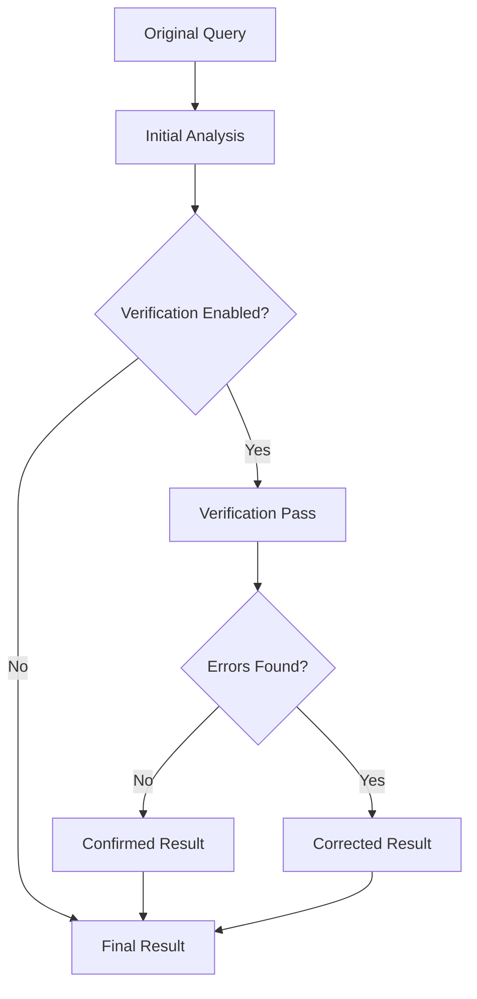

# Result Verification

Result verification is an advanced feature that reviews and potentially corrects insurance analysis outputs using a second LLM pass. This helps catch errors, reduce hallucinations, and improve overall accuracy.

## How Verification Works

The verification system performs a secondary analysis of the original result:



## Enabling Verification

### Basic Usage

Add the `--verifier` flag to enable single-pass verification:

```bash
python src/main.py \
    --model hf \
    --model-name microsoft/phi-4 \
    --prompt precise_v5 \
    --verifier
```

### Multiple Iterations

Use `--verifier-iterations` for multiple verification passes:

```bash
python src/main.py \
    --model hf \
    --model-name microsoft/phi-4 \
    --prompt precise_v5 \
    --verifier \
    --verifier-iterations 2
```

## Verification Process

### 1. Initial Analysis

The system first performs standard analysis:

```json
{
  "answer": {
    "eligibility": "Yes",
    "outcome_justification": "Baggage loss covered",
    "payment_justification": "€1000"
  }
}
```

### 2. Verification Review

The verifier checks:

- ✓ Eligibility decision correctness
- ✓ Quoted text exists in policy
- ✓ Logic connecting question to policy
- ✓ Amount accuracy

### 3. Verification Output

Results include verification status:

```json
{
  "answer": {
    "eligibility": "No - condition(s) not met",
    "outcome_justification": "Baggage loss covered only if reported within 24 hours",
    "payment_justification": null
  },
  "verification": {
    "status": "corrected",
    "changes_made": "Changed from Yes to No - late reporting condition not met"
  }
}
```

## Verification Strategies

### Conservative Verification

Single pass for basic error checking:

```bash
python src/main.py \
    --verifier \
    --verifier-iterations 1
```

### Thorough Verification

Multiple passes for maximum accuracy:

```bash
python src/main.py \
    --verifier \
    --verifier-iterations 3
```

### Selective Verification

Verify only specific questions:

```python
# In custom script
from models.verifier import SharedModelVerifier

# Only verify if initial confidence is low
if result['confidence'] < 0.8:
    verifier = SharedModelVerifier(model_client)
    verified_result, info = verifier.verify_result(
        question, context, result, iterations=2
    )
```

## Configuration Options

### Model-Specific Prompts

The verifier automatically selects appropriate prompts:

```python
# For Phi-4
verifier = SharedModelVerifier(model_client, model_type="phi4")

# For Qwen
verifier = SharedModelVerifier(model_client, model_type="qwen")
```

### Custom Verification Prompts

Create specialized verification logic:

```python
# src/prompts/custom_verification.py
def custom_verification_prompt() -> str:
    return """
    Review this insurance analysis for accuracy.
    
    ORIGINAL QUESTION:
    {{USER_QUESTION}}
    
    POLICY CONTEXT:
    {{POLICY_CONTEXT}}
    
    PREVIOUS RESULT:
    {{PREVIOUS_RESULT}}
    
    Check for:
    1. Temporal conditions (deadlines, time limits)
    2. Geographic restrictions
    3. Person eligibility
    4. Reporting requirements
    
    Output corrected JSON if needed.
    """
```

## Integration Examples

### Batch Processing with Verification

```bash
python src/main.py \
    --batch \
    --model hf \
    --model-name microsoft/phi-4 \
    --prompt precise_v5 \
    --verifier \
    --verifier-iterations 1 \
    --k 3
```

### Conditional Verification

```python
# Custom pipeline with selective verification
def process_with_smart_verification(question, context):
    # Initial analysis
    result = model_client.query(question, context)
    
    # Determine if verification needed
    needs_verification = (
        'condition' in question.lower() or
        'when' in question.lower() or
        'must' in question.lower() or
        result['answer']['eligibility'] == 'Yes'
    )
    
    if needs_verification:
        verifier = SharedModelVerifier(model_client)
        result, _ = verifier.verify_result(
            question, context, result, iterations=1
        )
    
    return result
```

### A/B Testing Verification

Compare with and without verification:

```bash
# Without verification
python src/main.py \
    --model hf \
    --model-name microsoft/phi-4 \
    --output-dir results/no_verify \
    --batch

# With verification
python src/main.py \
    --model hf \
    --model-name microsoft/phi-4 \
    --output-dir results/with_verify \
    --verifier \
    --batch
```

## Debugging Verification

### Enable Detailed Logging

```bash
python src/main.py \
    --verifier \
    --log-level DEBUG \
    --questions 1
```

Look for:
```
=== VERIFICATION ITERATION 1/1 ===
Verification response: {...}
Verification made corrections: eligibility changed
Changes made: Eligibility: 'Yes' → 'No - condition(s) not met'
```

## Common Issues

### Issue: Verification Loops

**Symptom**: Verifier keeps changing the same answer back and forth

**Solution**: Limit iterations and check for cycles
```bash
--verifier-iterations 2  # Don't go beyond 2-3
```

### Issue: Slow Performance

**Symptom**: Verification doubles/triples processing time

**Solution**: 

- Use single iteration for most cases
- Enable only for specific question types
- Consider parallel processing for batch jobs

## Verification Metrics

Track verification effectiveness:

```python
# Verification statistics
stats = {
    'total_queries': 0,
    'verified_queries': 0,
    'corrections_made': 0,
    'correction_types': {},
    'false_corrections': 0  # Manual review needed
}
```

## Next Steps

- Learn about [Batch Processing](batch-processing.md) with verification at scale
- Explore the [Evaluation System](../evaluation/overview.md) to measure verification impact
- See [Model Selection](model-selection.md) for verification compatibility